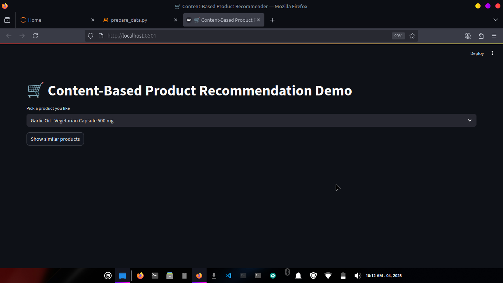
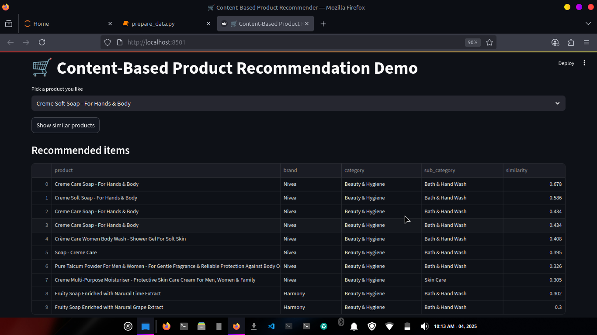

# Product-Recommendation-System
A Product Recommendation System built with Python, Scikit-learn, and Streamlit. It uses content-based filtering with TF-IDF and cosine similarity to suggest similar products based on descriptions. The interactive app demonstrates how machine learning enhances product discovery, personalization, and user experience in e-commerce platforms.
The `artefacts/` directory containing trained model files is excluded from the repository.
These files can be regenerated by running the data preparation script.

## How to Run

1. Install dependencies  
   pip install -r requirements.txt

2. Run the application  
   streamlit run app.py

## Screenshots

### Home Page

### Product Recommendations

